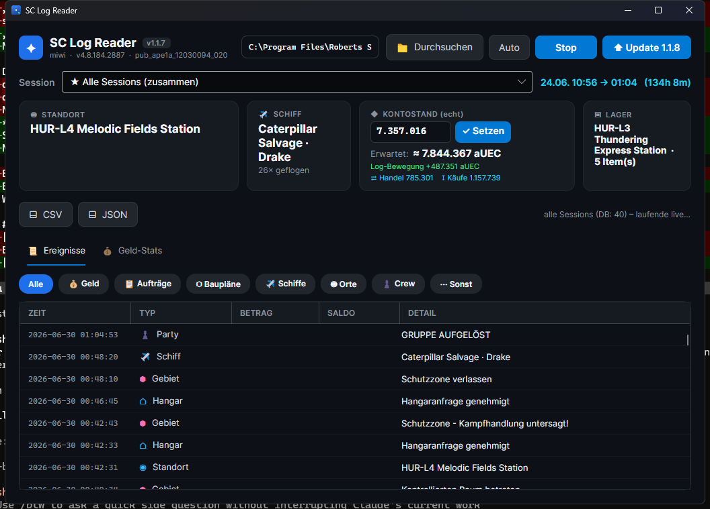

# 🛰️ SC Log Reader

**Live-Auswertung deiner Star-Citizen `Game.log`** — Geld, Aufträge, Schiffe, Handel,
Baupläne, Crew, Tode u.v.m. In Echtzeit, mit Geld-Statistik, mitlaufendem Kontostand
und persistentem Archiv. Eine einzige Windows-`.exe`, kein Setup, kein .NET nötig.

> ⚠️ **Inoffizielles Community-/Fan-Projekt.** Nicht mit Cloud Imperium Games (CIG)
> oder Roberts Space Industries (RSI) verbunden, von ihnen unterstützt oder autorisiert.
> Liest **ausschließlich lokal** die `Game.log` (**read-only**) — kein Eingriff ins Spiel,
> kein Memory-Zugriff, **AntiCheat-konform**. Siehe [Disclaimer](#-disclaimer).



---

## ✨ Was es kann

**💰 Geld & Wirtschaft**
- Geld rein/raus: Spieler-Überweisungen, Missions-Belohnungen, Käufe, Item-Verkäufe, Fracht-Handel, Angebote
- **Eigener Kontostand-Eingabe** → **mitlaufender Saldo** nach jedem rein/raus + „erwarteter Stand"
- **Geld-Statistik-Tab**: Einnahmen/Ausgaben nach Quelle (Balken), größte Posten, letzte Bewegungen (mit Datum)
- Item-Namen via **UEX-API**, ~750 Waren-Namen offline aus **scunpacked**

**📋 Aufträge & Fortschritt**
- Angenommene/abgeschlossene/geteilte Aufträge **mit Namen + Rang** (z.B. „RED WIND – Easy Cargo Recovery")
- Zähler für abgeschlossene Aufträge, **erhaltene Baupläne**, Rang-Aufstieg (NEULING → JUNIOR)

**🚀 Schiffe & Orte**
- Geflogene Flotte, aktuelles Schiff, **Quantum-Ankünfte**, Schiffsverluste (Kollision)
- Standorte mit **echten Namen** (z.B. `RR_HUR_LEO` → „Everus Harbor · Hurston"), Rechtsgebiete, Hangar

**👥 Crew & Sonstiges**
- Party-Mitglieder rein/raus (mit Namen), Freunde, Tode/Kampfunfähig, Fahrzeug-Beschlagnahmung, getragene Ausrüstung

**🛠️ Komfort**
- **Filter-Chips** (Geld, Aufträge, Schiffe, Crew …) + sortierbare Spalten
- **„Alle Sessions"** zusammen — schnell per **SQLite-Index**, Roh-Logs werden **archiviert** (überleben SC-Backup-Löschung)
- Live-Mitlesen während du spielst · **CSV/JSON-Export** · **Auto-Updater** · Tray-Icon
- **Online nachschlagen** (Rechtsklick/Doppelklick) · Deutsch

---

## 🚧 Aktive Entwicklung — und warum es „nur meine Logs" kann

Dieses Tool ist in **aktiver Entwicklung**. Wichtig zu wissen:

> **Ich kann nur das einbauen, was in MEINEN eigenen `Game.log`-Dateien auftaucht.**

Star Citizen schreibt je nach **Spielweise** unterschiedliche Dinge ins Log. Ich mache
v.a. Cargo/Handel/Salvage — also fehlen mir z.B. **Combat-Kills, Mining-Erträge, Refining,
bestimmte Missionstypen**, weil sie in meinen Logs schlicht **nicht vorkommen**.

Das heißt: Wenn du etwas spielst, das ich nicht spiele, hat **dein** Log Events,
die ich **nie sehe** — und genau die kann das Tool dann (noch) nicht.

---

## 🤝 Mithelfen (ganz einfach!)

Das Tool schreibt beim Start eine **`SCLogReader.debug.log`** neben die `.exe`.
Darin steht u.a. eine Liste **„unbekannte Notification-Typen"** — also alles, was in
deinem Log auftaucht, aber noch nicht ausgewertet wird.

**→ Schick mir diese `SCLogReader.debug.log`** (oder die „unbekannte Events"-Zeilen)
per [Issue](https://github.com/miwidot/SCLogReader/issues) — dann baue ich Support dafür ein.

So wächst das Tool über das hinaus, was ich allein erlebe. 💪

---

## ⬇️ Download

Neueste **[`SCLogReader.exe` → Releases](https://github.com/miwidot/SCLogReader/releases/latest)**
— eine Datei, doppelklicken, fertig. Prüft beim Start automatisch auf Updates.

---

## 🚀 Nutzung

**GUI:** Starten → Pfad wird **automatisch erkannt** (alle Laufwerke, LIVE/PTU/EPTU…),
sonst per **📁 Durchsuchen** wählen. **Start** liest live mit, während SC läuft.
Eigenen aUEC-Stand eintragen → **✓ Setzen** für den mitlaufenden Saldo.

**CLI (Batch über alle Logs):**
```
SCLogReader.exe --scan "C:\Program Files\Roberts Space Industries\StarCitizen\LIVE"
```

---

## 🔍 Was im Log erkannt wird

| Typ | Quelle im Log |
|-----|----------------|
| Geld rein/raus | `Überweisung erhalten von …` / `Sie haben … gesendet:` + Betragszeile |
| Belohnung | `<betrag> aUEC erhalten` |
| Kauf/Verkauf | `SShopBuyRequest` / `SShopSellRequest` (Item, Preis, GUID) |
| Handel (Fracht) | `SShopCommoditySellRequest` (Betrag, resourceGUID, Menge) |
| Auftrag | `Auftrag angenommen/abgeschlossen/geteilt` + `MissionEnded` |
| Schiff / Quantum | `ClearDriver … token for '<schiff>'` / `Quantum Drive Arrived` |
| Standort / Gebiet | `RequestLocationInventory … Location[<id>]` / Rechtsgebiete |
| Crew / Tode / Ausrüstung | Party-Beitritt/-Austritt, Kampfunfähig, `AttachmentReceived` … |

---

## 🧱 Bekannte Grenzen (Log-bedingt, nicht behebbar)

- **Auftrags-Belohnungen**: der Betrag wird **serverseitig** aufs Konto gebucht und steht
  **nicht im Log** — nur ein paar spezielle Rewards erzeugen eine sichtbare Meldung.
  (Das Tool zeigt deshalb die **Anzahl** abgeschlossener Aufträge + Hinweis.)
- **Lager**: nur **Stückzahl**, keine Warennamen/SCU.
- **Flotte/Schiffslager**: ASOP liefert nur eine *Anzahl*, keine Namen/Standorte (serverseitig).
- **Quantum**: nur **Ankunft** sicher; **Zielnamen** stehen nicht im Log.
- Käufe/Verkäufe sind Shop-*Requests* (mit `result[Success]` bestätigt).

---

## 🏗️ Technik

.NET 8 / **Avalonia** (Cross-platform), **SQLite**-Index + Roh-Log-Archiv, Single-File-`.exe`.
- `Core/LogParser.cs` — Zeilen-Parsing (Regex), `Core/LogTailer.cs` — Live-Lesen (Shared-Read)
- `Core/Database.cs` + `LogArchive.cs` — Session-Cache + Archiv (nachbaubar)
- `Core/Locations.cs` / `Ships.cs` / `CommoditiesData.cs` — lesbare Namen

Bauen: `dotnet build -c Release` · Release: `./release.ps1`

---

## 📜 Disclaimer

Dies ist ein **inoffizielles, von Fans erstelltes Community-Tool** und steht in
**keiner Verbindung** zu Cloud Imperium Games (CIG) oder der Roberts Space Industries
Group of Companies (RSI) und wird von diesen weder unterstützt, gesponsert noch autorisiert.

„Star Citizen", „Squadron 42", „Roberts Space Industries" und „Cloud Imperium" sind
Marken der jeweiligen Inhaber. Alle Spiel-Inhalte gehören CIG.

Das Tool liest ausschließlich die **lokale `Game.log`** (read-only) zur Auswertung
**deiner eigenen** Spielsitzungen. Es verändert das Spiel nicht, greift nicht in den
Spielprozess ein und liest keinen Speicher — daher AntiCheat-konform.
Nutzung auf **eigene Verantwortung**, ohne Gewähr.

Externe Daten: Item-Namen via [UEX](https://uexcorp.space),
Waren-/Spieldaten via [scunpacked](https://github.com/StarCitizenWiki/scunpacked-data).

## Lizenz
[MIT](LICENSE) — frei nutzbar, anpassbar, teilbar. Beiträge willkommen.
